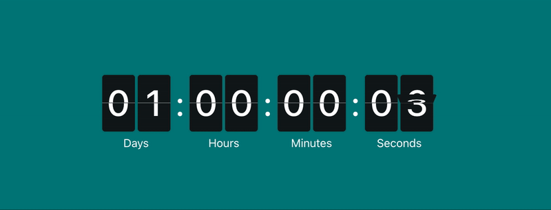

# react-flip-cards

> A generic, ref-driven 3D animated flip-card panel for React.

[](https://standardjs.com)

<div align="center">
  
</div>

This is **not** a countdown component. It renders a row of flip cards and lets
**you** own the values — drive them from a score, a timer, a data feed, anything.
Update them statically (props) or imperatively through a `ref`.

## Install

```bash
bun add react-flip-cards
# or
npm install react-flip-cards
```

Import the component and its stylesheet:

```tsx
import FlipCardPanel, { FlipCardRef } from 'react-flip-cards';
import 'react-flip-cards/dist/index.css';
```

## Usage

### 1. Static / controlled

Pass `initialValue` and leave it alone — a fixed scoreboard.

```tsx
<FlipCardPanel nrCards={5} blockStyle={{ width: 60, height: 80, fontSize: 48 }} initialValue={[0, 0, 0, 0, 0]} />
```

### 2. Ref-driven / imperative

Attach a `ref` and drive the cards without re-rendering the parent.

```tsx
function ScoreBoard() {
  const cardRef = useRef<FlipCardRef>(null);

  return (
    <>
      <FlipCardPanel ref={cardRef} nrCards={3} blockStyle={{ width: 60, height: 80, fontSize: 48 }} />
      <button onClick={() => cardRef.current?.set([1, 2, 3])}>Set 123</button>
      <button onClick={() => cardRef.current?.increment(2)}>+1 last digit</button>
      <button onClick={() => cardRef.current?.reset()}>Reset</button>
    </>
  );
}
```

### 3. With labels and separators

```tsx
<FlipCardPanel
  nrCards={3}
  labels={['Hours', 'Minutes', 'Seconds']}
  showLabels
  showSeparators
  blockStyle={{ width: 50, height: 70, fontSize: 40 }}
/>
```

## Ref API

`FlipCardPanel` forwards a `ref` exposing:

| Method                     | Description                                 |
| -------------------------- | ------------------------------------------- |
| `set(values: number[])`    | Set every card at once; changed cards flip. |
| `increment(index: number)` | Increment one card (wraps `9 → 0`).         |
| `reset()`                  | Reset all cards to `0`.                     |
| `getValue(): number[]`     | Read the currently displayed values.        |

## Props

`FlipCardPanel` accepts all `div` props plus:

| Name             | Type                         | Default | Description                                                                                     |
| ---------------- | ---------------------------- | ------- | ----------------------------------------------------------------------------------------------- |
| **nrCards**      | `number`                     | —       | **Required.** Number of flip cards to render.                                                   |
| `initialValue`   | `number[]`                   | all `0` | Initial value (0–9) per card; read once at mount.                                               |
| `labels`         | `(string \| ReactElement)[]` | —       | Label under each card.                                                                          |
| `showLabels`     | `boolean`                    | `true`  | Toggle label visibility.                                                                        |
| `blockStyle`     | `CSSProperties`              | —       | Card styles: `width`, `height`, `fontSize`, `color`, `background`, `borderRadius`, `boxShadow`. |
| `labelStyle`     | `CSSProperties`              | —       | Label styles (`fontSize`, `color`, …).                                                          |
| `showSeparators` | `boolean`                    | `false` | Show colon separators between cards.                                                            |
| `separatorStyle` | `{ color?, size? }`          | —       | Separator styling.                                                                              |
| `showDivider`    | `boolean`                    | `true`  | Show the horizontal divider across each card.                                                   |
| `dividerStyle`   | `{ color?, height? }`        | —       | Divider styling.                                                                                |
| `duration`       | `number`                     | `0.7`   | Flip animation duration (seconds).                                                              |
| `spacing`        | `number \| string`           | —       | Gap between cards / separators.                                                                 |
| `className`      | `string`                     | —       | Extra class on the container.                                                                   |

## Styling

All visual tokens are CSS custom properties (prefixed `--fcp-`) you can override
in your own CSS — or set per-instance via `blockStyle` / `labelStyle` etc.:

```css
.fcp__container {
  --fcp-background: #0f181a;
  --fcp-digit-color: #fff;
  --fcp-digit-block-radius: 4px;
  --fcp-flip-duration: 0.7s;
}
```

## Use cases

- **Score counter** — increment cards on button clicks.
- **Game timer** — tick an `MM:SS` display yourself via `set()`.
- **Data ticker** — push live numbers (stocks, metrics) from a data source.
- **Lap counter** — `increment(0)` a single card.
- **Scoreboard** — multi-digit score, e.g. `[1, 2, 3]` = "123".

See [`examples/react-app`](./examples/react-app) for a working score + lap counter.

## License

MIT
